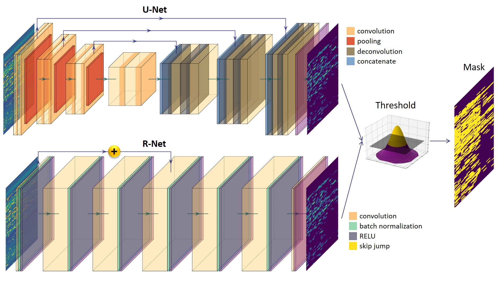

# RFI-classification

This directory containes the developed scripts for RFI classification. The pipe line is demotestrated in the bellow figure:

  

A sample of the results on HIDE simulations are:

  

The files are as follows:

**arch_?.py**s are the architectures. 

**mydataprovider.py** contains the data provider we used to feed the CNN. Pleaase notice that the data provider works in different modes based on the simulations we have. You may want to develope your own data provider.

**utils.py** contains some auxiliary fucntions.

The rest of the files are scripts to train either R-net or U-net on HIDE, MeerKAT and KAT7 datasets. 

The **trained models** will be shared after acceptance.

